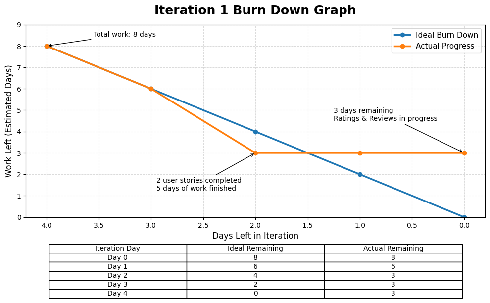
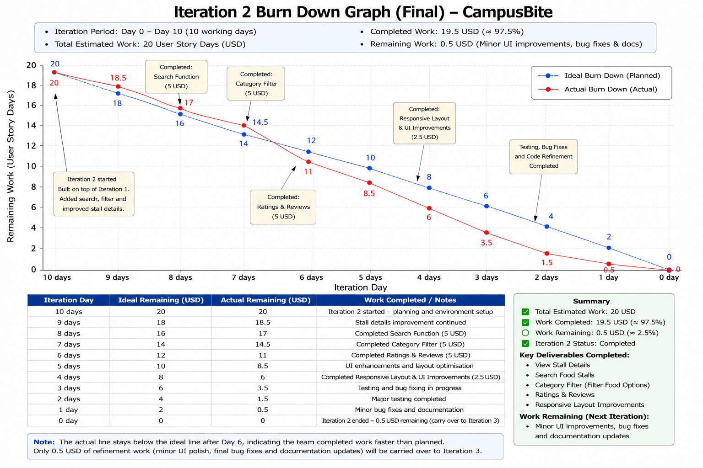
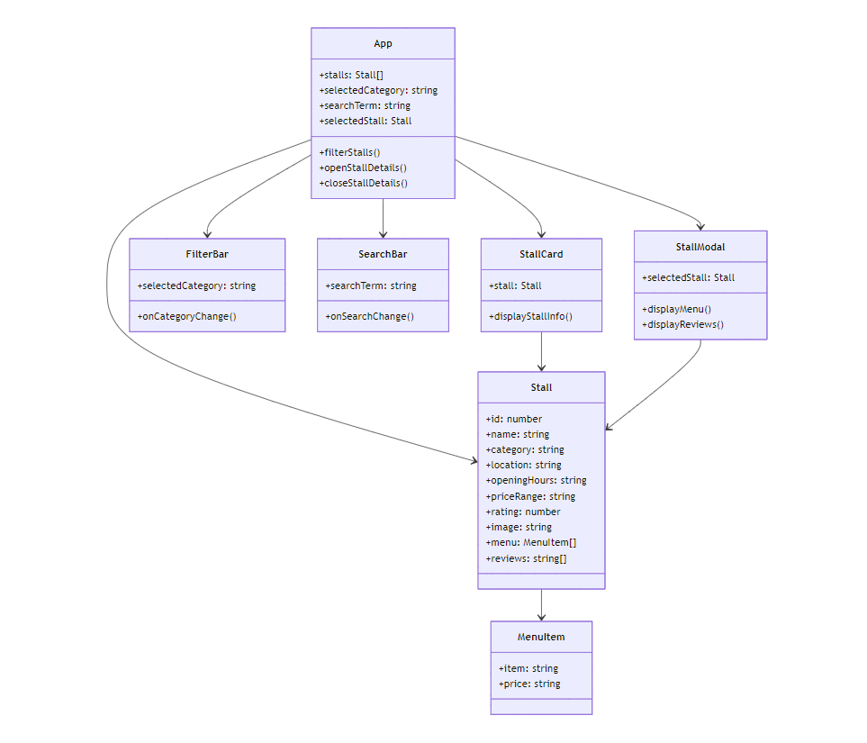
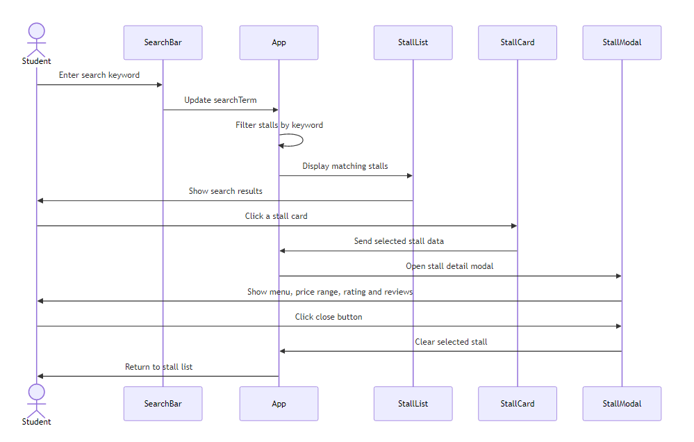

# CampusBite Food Stall Website
# Campus-Food-Review-Website-PC3

# CampusBite - Campus Food Review & Discovery Platform

## Project Description

CampusBite is a modern web-based platform designed to enhance the campus dining experience for university students.

It solves the common problem of scattered and unreliable food information by providing a centralized hub for campus food stalls. Students can easily discover stalls, view detailed menus and prices, read authentic peer reviews, and make informed dining decisions. At the same time, the platform offers valuable feedback to food vendors, helping them improve service quality and offerings.

## GitHub Link

GitHub Repository: https://github.com/BaoJiatao/campus-food-review-website-pc3

## Deployed Website Link

Website Link: https://campus-food-review-website-pc3.vercel.app

## Team Members

| Name | Role |
|---|---|
| Bao Jiatao | Project Lead / Developer |
| Lin Yan | Frontend Developer / UI/UX Designer |

## Project Objectives

- Create a centralized, reliable, and user-friendly platform for campus food discovery
- Help students make faster and better dining decisions
- Build a transparent feedback loop between students and food vendors
- Deliver a high-quality web application using iterative development

## Key Features

### Iteration 1 – Core MVP

- Homepage with all campus food stalls
- Detailed stall information, including menu, prices, operating hours, and location
- Average rating display and recent reviews

### Iteration 2 – User Interaction

- Advanced search and filtering
- Star rating and text review system

### Future Iterations

- AI-powered food recommendations
- Photo uploads with reviews
- Favorites and trending rankings
- Vendor or admin management dashboard

## Technology Stack

- Frontend: HTML, CSS, JavaScript / React
- Backend: Node.js and Express.js
- Database: MongoDB
- Version Control: Git and GitHub
- Deployment: Vercel

## Development Approach

This project follows an iterative development approach. Instead of building the whole system at once, the team focuses on small working features in each iteration. User feedback is collected and used to improve the next version of the website.

## Target Users

The target users are university students who frequently dine on campus. These users need a faster and clearer way to find food stall information, compare prices, check opening hours, and read reviews before deciding where to eat.

## User Requirements from Interview

Based on interviews with target users, students often face the following problems:

- Food stall information is difficult to find
- Students waste time checking which stalls are open
- Prices and menus are not always clear
- Students rely on peer recommendations
- Ratings and reviews are useful when choosing food
- Search and filter functions can help students save time

## Initial Backlog Ideas

Here are 10 rough user stories for the project:

1. As a student, I want to browse all food stalls on campus so that I can see what options are available.
2. As a student, I want to view detailed information of a food stall, including menu, price, opening hours, and location.
3. As a student, I want to see the average rating and recent reviews of each stall.
4. As a student, I want to search for food stalls by name or cuisine type.
5. As a student, I want to filter stalls by price range, rating, or category.
6. As a student, I want to submit a star rating and write a review for a food stall.
7. As a student, I want to upload a photo along with my review.
8. As a student, I want to save my favorite food stalls for future reference.
9. As a student, I want to get personalized recommendations, such as “What to eat today?”.
10. As an admin or vendor, I want to manage food stall information and view reviews.

## User Stories with Priority and Effort

| No. | Title | User Story | Priority | Estimated Effort |
|---|---|---|---|---|
| 1 | Browse Food Stalls | As a student, I want to browse all campus food stalls so that I can easily discover available options. | 10 | 2 days |
| 2 | View Stall Details | As a student, I want to view detailed stall information such as menu, prices, location, and opening hours so that I can make informed decisions. | 10 | 3 days |
| 3 | Search Food Stalls | As a student, I want to search food stalls by name or cuisine type so that I can find specific food quickly. | 20 | 2 days |
| 4 | Filter Food Options | As a student, I want to filter stalls by price range, rating, and category so that I can narrow down choices efficiently. | 20 | 2 days |
| 5 | View Ratings and Reviews | As a student, I want to see average ratings and recent reviews so that I can assess food quality before buying. | 20 | 3 days |
| 6 | Submit Reviews | As a student, I want to submit ratings and written reviews for stalls so that I can share my experience and help others. | 30 | 4 days |
| 7 | Upload Food Photos | As a student, I want to upload photos with my reviews so that reviews become more informative and engaging. | 30 | 3 days |
| 8 | Save Favorite Stalls | As a student, I want to save my favorite stalls so that I can easily access them later. | 40 | 2 days |
| 9 | Personalized Recommendations | As a student, I want personalized food recommendations based on my preferences and past ratings. | 40 | 5 days |
| 10 | Vendor/Admin Management | As a vendor or admin, I want to manage stall information and respond to reviews so that information stays accurate and up-to-date. | 50 | 5 days |

## Iteration 1 Plan

Based on the feedback collected in Practical 2, the team selected the most important features for Iteration 1.

### Selected User Stories

| User Story | Priority | Status |
|---|---|---|
| Browse Food Stalls | 10 | Completed |
| View Stall Details | 10 | In Progress |
| View Ratings and Reviews | 20 | To Do |

## Iteration Board

### To Do

- View Ratings and Reviews

### In Progress

- View Stall Details

### Done

- Browse Food Stalls

## Work Completed

During Iteration 1, the team completed the Browse Food Stalls feature. A simple homepage was developed to display available food stalls on campus. Students can now see a list of food options without needing to walk around campus to check each stall individually.

## Challenges Encountered

One challenge was deciding which features should be included in the first iteration. After reviewing the interview results, the team realised that students cared most about finding food information quickly. Therefore, the team chose to prioritise food stall browsing before implementing more advanced features.

Another challenge was keeping the interface simple while still displaying useful information. The team discussed different layouts and agreed to begin with a basic design that can be improved in later iterations.

## Project Status

The basic website has been completed and uploaded to GitHub. The current version provides a working foundation for the CampusBite project. More features such as search, filter, ratings, reviews, and admin management can be added in future iterations.

Start Date: May 2026  
Last Updated: June 2026

## Practical Week 3 – Iteration 1

### Objective

The objective of Practical Week 3 was to review the planned user stories for Iteration 1 and implement at least two user stories during the practical class.

### Iteration 1 User Stories

| User Story | Priority | Effort | Status |
|---|---:|---:|---|
| Browse Food Stalls | 10 | 2 days | Done |
| View Stall Details | 10 | 3 days | Done |
| View Ratings and Reviews | 20 | 3 days | In Progress |

### GitHub Project Board

The team created a GitHub Project Board to monitor the progress of Iteration 1. The board includes To do, In progress, and Done columns.

Current board status:

- Done: Browse Food Stalls
- Done: View Stall Details
- In Progress: View Ratings and Reviews

### Work Completed

During Iteration 1, the team completed two user stories: Browse Food Stalls and View Stall Details. These features allow students to browse available campus food stalls and view basic stall information such as menu items, prices, opening hours, and location.

### Burn Down Graph

The burn down graph tracks the remaining work for Iteration 1. The total estimated effort was 8 days. The ideal line shows the expected progress if the work decreases evenly each day. The actual line shows that the team completed two user stories, Browse Food Stalls and View Stall Details, which represent 5 days of work. The remaining 3 days belong to View Ratings and Reviews, which is still in progress.

### Reflection

This practical helped the team understand how to manage user stories using GitHub Issues, labels, and a Project Board. By moving tasks from To do to In progress and Done, the team could clearly track development progress. Although not all user stories were completed, the team successfully implemented at least two core user stories for Iteration 1.

## Practical 4: Iteration 1 - Execution and Tracking

In Practical 4, the project focuses on task breakdown, task estimation, GitHub issue tracking, class diagram, sequence diagram, daily commits and pull request review.
This branch is used to practise pull request creation and code review.

# Practical 6: Iteration 2 - Review and Planning

## Objective

The objective of Practical Week 6 was to review the progress achieved during Iteration 1 and prepare the development plan for Iteration 2. The team analysed the completed work, calculated the actual velocity, reviewed the software design, and updated the backlog based on the remaining user stories. This helped the team better organise the next stage of development and continue improving the CampusBite website.

---

## Actual Velocity

At the beginning of Iteration 1, the team estimated a total effort of **8 working days**. During the iteration, the team successfully completed the core features of the project, including browsing food stalls and viewing stall details. Additional improvements, such as the search function, category filtering and stall detail modal, were also implemented.

Overall, the team completed approximately **5 days of planned work** during Iteration 1. The remaining work mainly involves the Ratings & Reviews feature together with several interface improvements, which have been moved into Iteration 2. The calculated velocity provides a more realistic estimate for planning the next iteration and helps the team avoid overcommitting.

---

## SRP and DRY Review

The team reviewed the project structure to evaluate whether the implementation follows the **Single Responsibility Principle (SRP)** and the **Don't Repeat Yourself (DRY)** principle.

### Single Responsibility Principle (SRP)

Most components perform a single responsibility and have a clear purpose.

- **StallCard** is responsible for displaying summary information for each food stall.
- **SearchBar** handles searching food stalls by keyword.
- **CategoryFilter** is responsible for filtering stalls based on food categories.
- **StallDetailModal** displays detailed information such as menus, prices and opening hours.

Keeping these responsibilities separate makes the project easier to maintain and extend in future iterations.

### Don't Repeat Yourself (DRY)

The project also follows the DRY principle by reducing duplicated code.

- Reusable stall card components are used throughout the homepage.
- Search and filtering logic are implemented as reusable functions.
- Shared CSS styles are applied across different pages instead of repeating the same styling code.
- Common layouts are reused to improve consistency and simplify future maintenance.

Although the overall structure follows DRY well, some UI styling can still be further organised during Iteration 2.

---

## Burn Down Graph

The burn down graph below summarises the final progress of Iteration 1. The team completed most of the planned work, while the remaining tasks will continue into Iteration 2.

---

## Iteration 2 Backlog

Based on the remaining work from Iteration 1 and the team's actual velocity, the following backlog has been prepared for Iteration 2.

| User Story | Priority | Status |
|------------|----------|--------|
| View Ratings and Reviews | High | In Progress |
| Improve CSS Layout | Medium | In Progress |
| Improve Modal Layout | Medium | To Do |
| Create Pull Request for Review | Medium | To Do |
| Review and Merge Pull Request | Medium | To Do |
| Website Testing and Bug Fixes | High | To Do |

The team decided to focus on completing the unfinished core functionality before introducing additional features. This approach reduces development risk and ensures that the main user requirements are fully implemented before expanding the system.

---

## GitHub Project Board

The GitHub Project Board was updated to reflect the current development progress.

### To Do

- Improve Modal Layout
- Review and Merge Pull Request
- Final Website Testing
- Take Testing Screenshots
- Fix Remaining Bugs

### In Progress

- View Ratings and Reviews
- Improve CSS Layout
- Create Pull Request for Review

### Done

- Browse Food Stalls
- View Stall Details
- Search Function
- Category Filter
- Stall Detail Modal
- Homepage Responsive Layout
- Class Diagram
- Sequence Diagram

The updated board helps the team clearly monitor development progress and allocate tasks among team members throughout Iteration 2.

---

## Completed vs Unfinished User Stories

### Completed User Stories

- Browse Food Stalls
- View Stall Details
- Search Food Stalls
- Filter Food Options
- Stall Detail Modal
- Homepage Responsive Layout
- Class Diagram
- Sequence Diagram

### Unfinished User Stories

- View Ratings and Reviews
- Improve CSS Layout
- Improve Modal Layout
- Pull Request Review
- Final Website Testing
- Bug Fixes

The unfinished user stories have been prioritised for completion during Iteration 2 before introducing any new functionality.

---

## GitHub Pages Update

The latest completed features were pushed to GitHub and deployed to the project website. Updating GitHub Pages after each completed user story allows the team to verify the latest version online and receive feedback earlier in the development process. This also helps ensure that the deployed version stays consistent with the GitHub repository.

---

## Reflection

Practical Week 6 allowed the team to review the overall progress of Iteration 1 before continuing development.

By analysing the team's actual velocity and reviewing the remaining backlog, we gained a clearer understanding of what had been completed and what still required attention. GitHub Issues and the Project Board continued to be useful for tracking progress, assigning tasks and improving collaboration.

The review also showed that most core features have already been implemented successfully. The remaining work mainly focuses on improving the Ratings & Reviews feature, refining the user interface, conducting testing and preparing the project for completion.

Overall, the team now has a more realistic development plan for Iteration 2 based on actual project progress rather than initial estimates.

## Iteration 2 Plan

During Iteration 2, the team will prioritise completing the Ratings & Reviews feature, improving the website interface, fixing remaining issues, and carrying out additional testing. Once these tasks are completed, the team plans to continue developing advanced features such as personalised recommendations and user favourites.

# Practical 7: Iteration 2 - Test-Driven Development

## Testing Plan

### Objective

The objective of Practical 7 is to apply Test-Driven Development (TDD) during Iteration 2. After completing most of the core features in Iteration 1, the team will now focus on verifying that the implemented functions work correctly and remain stable as new features are added.

Testing also helps the team detect bugs earlier, improve software quality and reduce the possibility of breaking existing features during future development.

---

### Current Project Status

At the beginning of Practical 7, the CampusBite project has already completed most of the core user stories, including:

- Browse Food Stalls
- View Stall Details
- Search Food Stalls
- Category Filter
- Stall Detail Modal
- Responsive Homepage Layout

The Ratings & Reviews feature is currently under development and will continue during Iteration 2. Therefore, the testing activities will mainly focus on both completed features and the newly developed functionality.

---

### Testing Strategy

The team decided to combine manual testing and automated testing throughout Iteration 2.

Manual testing is first used during development to quickly verify new features and user interactions. After a feature works correctly, automated tests will be written to ensure the same functionality continues working after future code changes.

This follows the Test-Driven Development (TDD) approach by defining expected behaviour through test cases before verifying the implementation.

---

### Testing Scope

Based on the current project progress, the following user stories have been selected for testing:

1. Browse Food Stalls
2. View Stall Details
3. Search Food Stalls
4. Filter Food Options
5. View Ratings and Reviews

These user stories represent the main functionality currently available in the CampusBite website and cover the most common user interactions.

---

### Types of Testing

#### Functional Testing

Functional testing checks whether each feature behaves according to the user requirements.

Examples include:

- Displaying all food stalls correctly
- Opening stall details successfully
- Searching stalls using keywords
- Filtering stalls by category
- Viewing ratings and reviews correctly

---

#### User Interface Testing

UI testing verifies that all visible components display correctly and remain usable.

The team will check:

- Stall cards
- Search bar
- Category buttons
- Stall detail modal
- Ratings and review section
- Responsive layout

---

#### Input Validation Testing

Input validation testing ensures the system handles invalid or unexpected user input correctly.

Examples include:

- Empty search keywords
- Invalid search terms
- Empty review submission
- Invalid rating values

---

#### Regression Testing

Regression testing is performed whenever new code is added to ensure existing features continue working correctly.

Since Iteration 2 mainly extends the existing website, regression testing is important after implementing the Ratings & Reviews feature and interface improvements.

---

### Automated Testing Plan

The team plans to implement automated tests for the selected user stories.

Automated tests will verify:

- Stall cards render correctly.
- Search returns the correct results.
- Category filtering displays matching stalls.
- Stall detail modal opens correctly.
- Ratings and reviews display expected information.

At least fifteen automated tests will be implemented during this practical to improve software reliability and reduce manual testing effort.

---

### Testing Environment

The project is developed using React and Vite.

Testing will be performed in the local development environment before code is committed to GitHub. Automated tests will be executed before pull requests are merged to ensure new changes do not introduce unexpected errors.

The website will also be tested manually using desktop and mobile browser sizes to confirm that the interface remains responsive and user-friendly.

---

### Expected Outcomes

After Practical 7, the project should achieve the following:

- Main user stories are verified through test cases.
- At least fifteen automated tests are implemented.
- Existing features remain stable after new code changes.
- Bugs are detected earlier during development.
- The overall quality and maintainability of the CampusBite website are improved.

## Selected User Stories

For Practical 7, the team selected five core user stories that represent the main functionality of the current CampusBite system. These user stories have either been completed during Iteration 1 or are currently being developed in Iteration 2. They will be used to design manual test cases and automated tests.

### User Story 1 – Browse Food Stalls

**User Story**

> As a student, I want to browse all campus food stalls so that I can easily discover available food options.

---

#### Test Case TC-001

| Item | Description |
|------|-------------|
| **Test ID** | TC-001 |
| **Test Objective** | Verify that all food stalls are displayed on the homepage. |
| **Precondition** | The CampusBite website has been launched successfully. |
| **Test Steps** | 1. Open the CampusBite homepage. 2. Wait for the page to finish loading. |
| **Expected Result** | All available food stalls are displayed as stall cards on the homepage. |

---

#### Test Case TC-002

| Item | Description |
|------|-------------|
| **Test ID** | TC-002 |
| **Test Objective** | Verify that each stall card displays the correct information. |
| **Precondition** | The homepage has loaded successfully. |
| **Test Steps** | 1. View any food stall card on the homepage. 2. Check the displayed information. |
| **Expected Result** | Each stall card displays the stall name, image, food category and a short description correctly. |

---

#### Test Case TC-003

| Item | Description |
|------|-------------|
| **Test ID** | TC-003 |
| **Test Objective** | Verify that users can browse all food stalls by scrolling through the homepage. |
| **Precondition** | The homepage contains multiple food stalls. |
| **Test Steps** | 1. Open the homepage. 2. Scroll from the top to the bottom of the page. |
| **Expected Result** | All food stalls can be viewed successfully without missing content or layout errors. |

---

### User Story 2 – View Stall Details

**User Story**

> As a student, I want to view detailed information about a food stall, including menu items, prices, opening hours and location, so that I can make informed dining decisions.

---

#### Test Case TC-004

| Item | Description |
|------|-------------|
| **Test ID** | TC-004 |
| **Test Objective** | Verify that the stall detail modal opens successfully when a food stall is selected. |
| **Precondition** | The CampusBite homepage has loaded successfully. |
| **Test Steps** | 1. Open the homepage. 2. Click on any food stall card. |
| **Expected Result** | The stall detail modal opens and displays the selected food stall information. |

---

#### Test Case TC-005

| Item | Description |
|------|-------------|
| **Test ID** | TC-005 |
| **Test Objective** | Verify that the correct stall information is displayed in the detail modal. |
| **Precondition** | The stall detail modal is open. |
| **Test Steps** | 1. Select any food stall. 2. Check the displayed information inside the modal. |
| **Expected Result** | The modal correctly displays the stall name, menu items, prices, opening hours and location. |

---

#### Test Case TC-006

| Item | Description |
|------|-------------|
| **Test ID** | TC-006 |
| **Test Objective** | Verify that users can close the stall detail modal successfully. |
| **Precondition** | The stall detail modal is open. |
| **Test Steps** | 1. Open any stall detail modal. 2. Click the close button or outside the modal. |
| **Expected Result** | The modal closes successfully and the homepage remains displayed without any errors. |

---

### User Story 3 – Search Food Stalls

**User Story**

> As a student, I want to search food stalls by name so that I can quickly find the food I want.

---

#### Test Case TC-007

| Item | Description |
|------|-------------|
| **Test ID** | TC-007 |
| **Test Objective** | Verify that users can search for a food stall using a valid keyword. |
| **Precondition** | The CampusBite homepage has loaded successfully and food stall data is available. |
| **Test Steps** | 1. Open the homepage. 2. Enter a valid food stall name or keyword into the search bar. 3. Press Enter or wait for the search results. |
| **Expected Result** | Only food stalls that match the search keyword are displayed. |

---

#### Test Case TC-008

| Item | Description |
|------|-------------|
| **Test ID** | TC-008 |
| **Test Objective** | Verify that the system handles search keywords with no matching results. |
| **Precondition** | The homepage has loaded successfully. |
| **Test Steps** | 1. Enter a keyword that does not match any food stall. 2. Execute the search. |
| **Expected Result** | No food stalls are displayed and a suitable message such as "No results found" is shown. |

---

#### Test Case TC-009

| Item | Description |
|------|-------------|
| **Test ID** | TC-009 |
| **Test Objective** | Verify that the search function works regardless of letter case. |
| **Precondition** | Food stall data has been loaded successfully. |
| **Test Steps** | 1. Enter a valid food stall name using uppercase or lowercase letters. 2. Execute the search. |
| **Expected Result** | The correct food stall is displayed regardless of whether uppercase or lowercase letters are used. |

---

### User Story 4 – Filter Food Options

**User Story**

> As a student, I want to filter food stalls by category so that I can narrow down my choices more efficiently.

---

#### Test Case TC-010

| Item | Description |
|------|-------------|
| **Test ID** | TC-010 |
| **Test Objective** | Verify that users can filter food stalls by selecting a food category. |
| **Precondition** | The CampusBite homepage has loaded successfully. |
| **Test Steps** | 1. Open the homepage. 2. Select a food category from the category filter. |
| **Expected Result** | Only food stalls belonging to the selected category are displayed. |

---

#### Test Case TC-011

| Item | Description |
|------|-------------|
| **Test ID** | TC-011 |
| **Test Objective** | Verify that changing the selected category updates the displayed food stalls correctly. |
| **Precondition** | A food category has already been selected. |
| **Test Steps** | 1. Select one food category. 2. Select a different food category. |
| **Expected Result** | The displayed food stalls are updated immediately to match the newly selected category. |

---

#### Test Case TC-012

| Item | Description |
|------|-------------|
| **Test ID** | TC-012 |
| **Test Objective** | Verify that users can clear the category filter and display all food stalls again. |
| **Precondition** | A category filter is currently applied. |
| **Test Steps** | 1. Click the "All" category or reset the filter. 2. Observe the homepage. |
| **Expected Result** | All available food stalls are displayed again without any category restrictions. |

---

### User Story 5 – View Ratings and Reviews

**User Story**

> As a student, I want to view ratings and reviews for each food stall so that I can decide where to eat based on other students' experiences.

---

#### Test Case TC-013

| Item | Description |
|------|-------------|
| **Test ID** | TC-013 |
| **Test Objective** | Verify that the average rating is displayed for the selected food stall. |
| **Precondition** | The CampusBite homepage has loaded successfully and rating data is available. |
| **Test Steps** | 1. Open the homepage. 2. Select a food stall. 3. View the rating section in the stall details. |
| **Expected Result** | The average rating for the selected food stall is displayed correctly. |

---

#### Test Case TC-014

| Item | Description |
|------|-------------|
| **Test ID** | TC-014 |
| **Test Objective** | Verify that recent reviews are displayed for the correct food stall. |
| **Precondition** | The selected food stall contains review data. |
| **Test Steps** | 1. Open the details of a food stall. 2. Scroll to the reviews section. 3. Check the displayed reviews. |
| **Expected Result** | The recent reviews associated with the selected food stall are displayed correctly. |

---

#### Test Case TC-015

| Item | Description |
|------|-------------|
| **Test ID** | TC-015 |
| **Test Objective** | Verify that the system handles a food stall with no available reviews. |
| **Precondition** | A food stall with no review data is available. |
| **Test Steps** | 1. Open the details of a food stall with no reviews. 2. View the ratings and reviews section. |
| **Expected Result** | The page remains stable and displays a clear message such as "No reviews yet" instead of showing incorrect or empty content. |

# Practical 8: Iteration 3

## Objective

The objective of Practical 8 is to continue Iteration 3 by applying Test-Driven Development (TDD) while refining the CampusBite website. Building on the completed work from Iteration 2, the team focuses on improving software quality, fixing remaining issues, performing final testing, and preparing the project for completion.

---

## Iteration 2 Reflection

Iteration 2 was successfully completed with the implementation of the major planned user stories. During this iteration, the team finished the search function, category filter, ratings and reviews, responsive layout improvements, and overall interface refinement.

Compared with Iteration 1, the project became more complete and user-friendly. The GitHub Project Board was continuously updated to monitor development progress, while automated testing helped identify and prevent software defects during implementation.

The completed work from Iteration 2 provides a stable foundation for the final iteration.

---

## Actual Velocity

The team completed nearly all planned user stories during Iteration 2.

**Planned Velocity:** 100%

**Actual Velocity:** Approximately 95–100%

Only minor improvements, optimisation tasks, documentation updates, and final verification remain for Iteration 3.

---

## Burn Down Graph

The burn down graph shows that the remaining workload decreased steadily throughout Iteration 2. Most development tasks were completed before the end of the sprint, demonstrating consistent progress and effective sprint planning.

---

## Iteration 3 Backlog

The remaining backlog for Iteration 3 focuses mainly on software quality rather than new functionality.

### Remaining Tasks

- Improve UI consistency
- Fix minor layout issues
- Refactor existing code
- Perform final regression testing
- Verify automated test results
- Improve project documentation
- Prepare final deployment
- Complete final project review

---

## GitHub Project Board

The GitHub Project Board has been updated to reflect the current progress of Iteration 3.

### Completed Features

- Browse Food Stalls
- View Stall Details
- Search Food Stalls
- Category Filter
- Ratings & Reviews
- Responsive Layout

### Current Focus

- Final testing
- Bug fixing
- Code refactoring
- Documentation updates

---

## Mock Object Research

To improve testing reliability, the team researched the use of Mock Objects in software testing.

Mock Objects simulate external dependencies such as databases or APIs, allowing components to be tested independently without relying on real services. This helps produce repeatable and stable automated tests while reducing the influence of external factors.

Although the current project mainly uses static data, mock objects can be introduced in future versions when integrating backend APIs or databases.

Example applications include:

- Simulating food stall data
- Simulating user reviews
- Simulating API responses
- Simulating database queries

Using Mock Objects improves test isolation, increases test reliability, and supports the Test-Driven Development process.

---

## Reflection

Practical 8 marks the final development stage of the project. Compared with previous iterations, the focus shifted from implementing new features to improving software quality, testing, and code maintainability.

Applying Test-Driven Development encouraged the team to think about testing earlier in the development process, resulting in more reliable and maintainable code. Continuous use of GitHub Issues, Project Boards, Pull Requests, and automated testing also helped the team manage project progress effectively.

Overall, Iteration 3 strengthened the stability and quality of the CampusBite platform and prepared the project for final delivery.
This branch is used to practise pull request creation and code review.

## Class Diagram

The class diagram below shows the main components and data structure of the CampusBite food stall website.

## Sequence Diagram

The sequence diagram below shows how a student searches for a stall and opens the stall detail modal.

